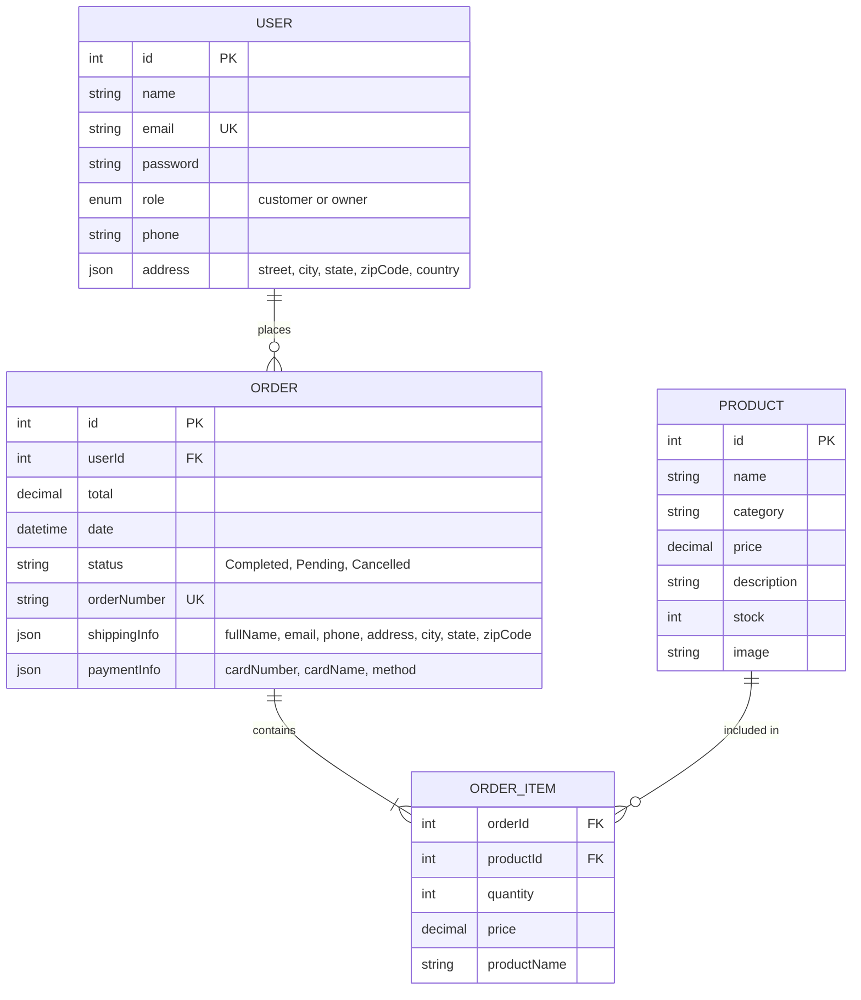

# 🗄️ SipStop E-Commerce Application - ER Diagram

## Entity-Relationship Diagram



---

## 📊 Detailed Entity Descriptions

### 1. **USER Entity**

| Attribute | Type | Constraints | Description |
|-----------|------|-------------|-------------|
| **id** | Integer | PRIMARY KEY, AUTO_INCREMENT | Unique user identifier |
| **name** | String | NOT NULL | User's full name |
| **email** | String | UNIQUE, NOT NULL | User's email (used for login) |
| **password** | String | NOT NULL | Encrypted password |
| **role** | Enum | NOT NULL | 'customer' or 'owner' |
| **phone** | String | OPTIONAL | Contact number |
| **address** | JSON | OPTIONAL | Embedded address object |
| └─ street | String | OPTIONAL | Street address |
| └─ city | String | OPTIONAL | City name |
| └─ state | String | OPTIONAL | State/Province |
| └─ zipCode | String | OPTIONAL | Postal code |
| └─ country | String | OPTIONAL | Country name |

**Business Rules:**
- Email must be unique across the system
- Role determines access level (owner = admin, customer = shopper)
- Password should be encrypted (not stored in plain text in production)

---

### 2. **PRODUCT Entity**

| Attribute | Type | Constraints | Description |
|-----------|------|-------------|-------------|
| **id** | Integer | PRIMARY KEY, AUTO_INCREMENT | Unique product identifier |
| **name** | String | NOT NULL | Product name |
| **category** | String | NOT NULL | Product category (whisky, beer, wine, etc.) |
| **price** | Decimal(10,2) | NOT NULL, > 0 | Product price |
| **description** | String | NOT NULL | Product description |
| **stock** | Integer | NOT NULL, >= 0 | Available quantity |
| **image** | String | NOT NULL | Product image URL |

**Business Rules:**
- Stock must be non-negative
- Price must be greater than 0
- Stock is automatically reduced when order is placed
- Out-of-stock products (stock = 0) cannot be added to cart

---

### 3. **ORDER Entity**

| Attribute | Type | Constraints | Description |
|-----------|------|-------------|-------------|
| **id** | Integer | PRIMARY KEY, AUTO_INCREMENT | Unique order identifier |
| **userId** | Integer | FOREIGN KEY, NOT NULL | References USER(id) |
| **total** | Decimal(10,2) | NOT NULL | Total order amount (with tax) |
| **date** | DateTime | NOT NULL | Order creation timestamp |
| **status** | String | NOT NULL | Order status |
| **orderNumber** | String | UNIQUE | Human-readable order number (e.g., SS340588) |
| **shippingInfo** | JSON | OPTIONAL | Delivery address details |
| └─ fullName | String | REQUIRED | Recipient name |
| └─ email | String | REQUIRED | Contact email |
| └─ phone | String | REQUIRED | Contact phone |
| └─ address | String | REQUIRED | Street address |
| └─ city | String | REQUIRED | City name |
| └─ state | String | REQUIRED | State/Province |
| └─ zipCode | String | REQUIRED | Postal code |
| **paymentInfo** | JSON | OPTIONAL | Payment details |
| └─ cardNumber | String | MASKED | Last 4 digits only (****1234) |
| └─ cardName | String | OPTIONAL | Cardholder name |
| └─ method | String | OPTIONAL | Payment method (Card, PayPal) |

**Business Rules:**
- Each order must belong to a user (userId cannot be null)
- Order status can be: 'Completed', 'Pending', 'Cancelled'
- Total includes product costs + tax (10%)
- OrderNumber is auto-generated (format: SS + random 6 digits)
- Once order is placed, product stock is reduced

---

### 4. **ORDER_ITEM Entity** (Junction Table)

| Attribute | Type | Constraints | Description |
|-----------|------|-------------|-------------|
| **orderId** | Integer | FOREIGN KEY, NOT NULL | References ORDER(id) |
| **productId** | Integer | FOREIGN KEY, NOT NULL | References PRODUCT(id) |
| **quantity** | Integer | NOT NULL, > 0 | Number of units ordered |
| **price** | Decimal(10,2) | NOT NULL | Product price at time of order |
| **productName** | String | NOT NULL | Product name (denormalized) |

**Composite Primary Key:** (orderId, productId)

**Business Rules:**
- Quantity must be greater than 0
- Price is captured at order time (historical data)
- Product details are denormalized for historical accuracy

---

## 🔗 Relationships

### 1. **USER → ORDER** (One-to-Many)
- **Cardinality:** 1:N
- **Description:** One user can place multiple orders
- **Foreign Key:** ORDER.userId → USER.id
- **Cascade Rule:** 
  - On DELETE: RESTRICT (cannot delete user with existing orders)
  - On UPDATE: CASCADE

### 2. **ORDER → ORDER_ITEM** (One-to-Many)
- **Cardinality:** 1:N
- **Description:** One order contains multiple order items
- **Foreign Key:** ORDER_ITEM.orderId → ORDER.id
- **Cascade Rule:**
  - On DELETE: CASCADE (delete items when order is deleted)
  - On UPDATE: CASCADE

### 3. **PRODUCT → ORDER_ITEM** (One-to-Many)
- **Cardinality:** 1:N
- **Description:** One product can appear in multiple orders
- **Foreign Key:** ORDER_ITEM.productId → PRODUCT.id
- **Cascade Rule:**
  - On DELETE: RESTRICT (cannot delete product in existing orders)
  - On UPDATE: CASCADE

---

## 📈 Cardinality Summary

```
USER (1) ────────< (N) ORDER
                    │
                    │
                    ├─────< (N) ORDER_ITEM >─────┤
                                                  │
PRODUCT (1) ──────────────────────────────────────┘
```

**Read as:**
- A USER places zero or many ORDERS
- An ORDER belongs to exactly one USER
- An ORDER contains one or many ORDER_ITEMs
- An ORDER_ITEM belongs to exactly one ORDER
- A PRODUCT is included in zero or many ORDER_ITEMs
- An ORDER_ITEM references exactly one PRODUCT

---

## 🎯 Key Constraints

### Primary Keys
- `USER.id`
- `PRODUCT.id`
- `ORDER.id`
- `(ORDER_ITEM.orderId, ORDER_ITEM.productId)` - Composite key

### Foreign Keys
- `ORDER.userId` → `USER.id`
- `ORDER_ITEM.orderId` → `ORDER.id`
- `ORDER_ITEM.productId` → `PRODUCT.id`

### Unique Constraints
- `USER.email` - Must be unique
- `ORDER.orderNumber` - Must be unique

### Check Constraints
- `PRODUCT.price > 0`
- `PRODUCT.stock >= 0`
- `ORDER_ITEM.quantity > 0`
- `ORDER.total > 0`
- `USER.role IN ('customer', 'owner')`

---

## 📊 Sample Data Flow

### Example: Customer Places an Order

```
1. USER (id: 3, role: 'customer')
   ↓
2. Selects PRODUCTS (id: 1, 2, 5)
   ↓
3. Creates ORDER (id: 10, userId: 3, total: 450.00)
   ↓
4. Creates ORDER_ITEMs:
   - (orderId: 10, productId: 1, quantity: 2)
   - (orderId: 10, productId: 2, quantity: 1)
   - (orderId: 10, productId: 5, quantity: 3)
   ↓
5. Reduces PRODUCT.stock for each item
   ↓
6. Sends confirmation email to USER.email
```

---

## 🔒 Data Integrity Rules

### 1. **Referential Integrity**
- Every ORDER must reference a valid USER
- Every ORDER_ITEM must reference a valid ORDER and PRODUCT
- Orphaned records are not allowed

### 2. **Business Logic Integrity**
- Stock validation before order placement
- Price consistency within an order
- Order total = SUM(ORDER_ITEM.price × quantity) + tax
- Status transitions: Pending → Completed or Cancelled

### 3. **Data Quality**
- Email format validation
- Phone number format validation
- Non-negative stock levels
- Positive prices and quantities

---

## 📱 Storage Implementation

**Current Implementation:** JSON File-based storage
- `users.json` - Stores USER entities
- `products.json` - Stores PRODUCT entities
- `orders.json` - Stores ORDER entities with embedded ORDER_ITEMs

**ORDER_ITEMs** are stored as nested arrays within orders:
```json
{
  "id": 1,
  "userId": 3,
  "items": [
    {
      "product": { /* full product object */ },
      "quantity": 2
    }
  ]
}
```

---

## 🚀 Potential Database Migration

For production, consider migrating to a relational database:

### PostgreSQL Schema
```sql
CREATE TABLE users (
    id SERIAL PRIMARY KEY,
    name VARCHAR(255) NOT NULL,
    email VARCHAR(255) UNIQUE NOT NULL,
    password VARCHAR(255) NOT NULL,
    role VARCHAR(20) CHECK (role IN ('customer', 'owner')),
    phone VARCHAR(20),
    address JSONB
);

CREATE TABLE products (
    id SERIAL PRIMARY KEY,
    name VARCHAR(255) NOT NULL,
    category VARCHAR(100) NOT NULL,
    price DECIMAL(10,2) NOT NULL CHECK (price > 0),
    description TEXT,
    stock INTEGER NOT NULL CHECK (stock >= 0),
    image VARCHAR(500)
);

CREATE TABLE orders (
    id SERIAL PRIMARY KEY,
    user_id INTEGER NOT NULL REFERENCES users(id),
    total DECIMAL(10,2) NOT NULL,
    date TIMESTAMP DEFAULT CURRENT_TIMESTAMP,
    status VARCHAR(50) NOT NULL,
    order_number VARCHAR(20) UNIQUE,
    shipping_info JSONB,
    payment_info JSONB
);

CREATE TABLE order_items (
    order_id INTEGER REFERENCES orders(id) ON DELETE CASCADE,
    product_id INTEGER REFERENCES products(id),
    quantity INTEGER NOT NULL CHECK (quantity > 0),
    price DECIMAL(10,2) NOT NULL,
    product_name VARCHAR(255),
    PRIMARY KEY (order_id, product_id)
);
```

---

## 📊 Analytics & Reporting Views

### Revenue by Product
```sql
SELECT 
    p.name,
    SUM(oi.quantity) as units_sold,
    SUM(oi.price * oi.quantity) as revenue
FROM products p
JOIN order_items oi ON p.id = oi.product_id
GROUP BY p.id, p.name
ORDER BY revenue DESC;
```

### Customer Order History
```sql
SELECT 
    u.name,
    COUNT(o.id) as total_orders,
    SUM(o.total) as total_spent
FROM users u
LEFT JOIN orders o ON u.id = o.user_id
WHERE u.role = 'customer'
GROUP BY u.id, u.name;
```

---

## 🎯 Summary

This ER diagram represents a complete e-commerce system with:
- ✅ User management (customers and owners)
- ✅ Product catalog with inventory
- ✅ Order processing with items
- ✅ Historical price tracking
- ✅ Shipping and payment information
- ✅ Data integrity and business rules

**Total Entities:** 4 (USER, PRODUCT, ORDER, ORDER_ITEM)  
**Total Relationships:** 3 (One-to-Many relationships)  
**Storage:** JSON files (can migrate to SQL database)

---

**Created for:** SipStop E-Commerce Application  
**Date:** November 2025  
**Version:** 1.0

